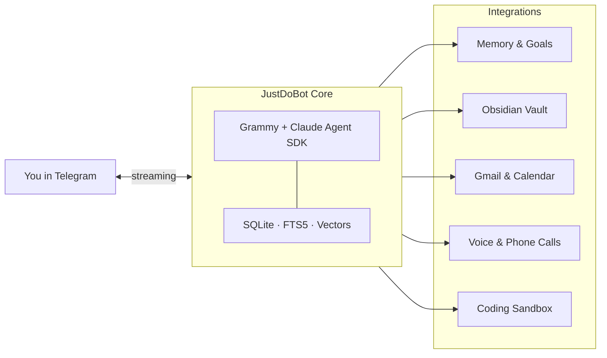

# JustDoBot

JustDoBot is an AI workhorse for everyday life and work, built with **Bun**, **Grammy**, and the **Claude Agent SDK**, using Telegram as the primary interface.
It runs on a Claude subscription workflow, so in this mode you do not pay per-request API costs.
It is security-first, multilingual, and easy to set up with one command plus a graphical setup panel.
The architecture is plugin-based, so features can be extended without rewriting the whole bot.

## Installation

Install the bot with one command:

```bash
curl -fsSL https://justdobot.com/install.sh | bash
```

It installs dependencies and opens the setup UI in your browser.

## How JustDoBot Works



Run locally with `bun run start` for development, or `bun run docker` for isolated production.

## Why This Bot

- **Claude Agent SDK**: real agent workflow with tool use, not a simple chatbot wrapper.
- **Subscription workflow**: no API pay-per-call costs in this operating mode.
- **Secure by design**: local data storage, isolated coding sandbox, controlled integrations.
- **Telegram-first UX**: streaming replies directly in Telegram.
- **Multilingual**: supports 15 interface/response languages.
- **Easy setup**: one command install + web setup wizard.
- **Extensible**: plugin architecture (IPlugin interface) for AI, memory, vault, voice, collectors, and code execution.

## How You Use It

1. Chat with the bot in Telegram.
2. Get streaming answers as the response is generated.
3. The bot automatically remembers useful facts and preferences.
4. It tracks goals and deadlines.
5. It can proactively message you when something important needs attention.

## Core Features

- **Telegram assistant with streaming output**: fast, live response updates in chat.
- **Automatic memory**: stores personal preferences, facts, and relevant insights.
- **Goal tracking**: keeps active goals with statuses, notes, and deadlines.
- **Local-first data**: messages, memories, goals, and indexes are stored in local SQLite.
- **Hybrid search**: SQLite FTS5 full-text search combined with local vector embeddings for accurate context retrieval.

## Optional Integrations

- **Obsidian vault**: index and search your notes from Telegram.
- **Google Gmail + Calendar**: add context for proactive reminders and nudges.
- **Voice in Telegram**: speech-to-text and text-to-speech via Gemini or ElevenLabs.
- **Urgent phone calls via Twilio**: bot can place outbound calls to deliver critical info.
  Full two-way phone conversation mode is planned for an upcoming release.

## Proactive Behavior

When enabled, the bot can start the conversation itself.
It checks Gmail, Google Calendar, active goals with deadlines, and recent conversation context, then sends a proactive message only when something needs your attention.
It also supports cooldowns and quiet hours to avoid noise.

## Coding Sandbox

You can ask in Telegram: “Build project X”.
The main assistant delegates the task to a dedicated coding agent.
That agent runs code inside an isolated Docker sandbox and can deliver a full project end-to-end.
This includes safe execution boundaries and progress updates back to Telegram.

## Security & Privacy

- Secrets are read from environment variables and `.env` (not committed to git).
- Setup UI runs on `localhost` and masks sensitive values.
- Data is stored locally (SQLite database + local indexes).
- Coding tasks run in an isolated container with restricted resources and network controls.

## Setup and Run

### Manual Setup (alternative to one-command install)

```bash
git clone https://github.com/OlegTestov/JustDoBot.git
cd JustDoBot
bun install
bun run web-setup
```

Or use terminal setup:

```bash
bun run setup
```

### Run

```bash
bun run start
```

Best for local development. Less isolated than Docker.

### Docker

```bash
bun run docker
```

Recommended for production. More isolated and safer by default.

## Commands

| Command | Description |
|---------|-------------|
| `/start` | Welcome message and overview |
| `/help` | Command list |
| `/clear` | Start a new session |
| `/cancel` | Stop current response |
| `/goals` | Show active goals |
| `/memory [query]` | Show or search saved memories |
| `/forget <id>` | Delete a memory |
| `/vault [query]` | Vault stats or search |
| `/note <text>` | Create a vault note |
| `/reindex` | Reindex vault content |
| `/quiet [hours]` | Pause proactive messages |
| `/status` | Health and runtime status |
| `/backup` | JSON + SQLite backup |
| `/projects` | List coding projects |
| `/project_stop <name>` | Stop a running coding task |
| `/project_delete <name>` | Delete a project |

## Troubleshooting

```bash
bun run doctor
```

## Development

```bash
bun test
bun run check
bun run lint:fix
```

## More Details

- Full architecture: `ARCHITECTURE.md`
- Configuration options: `config.example.yaml`

## License

MIT
